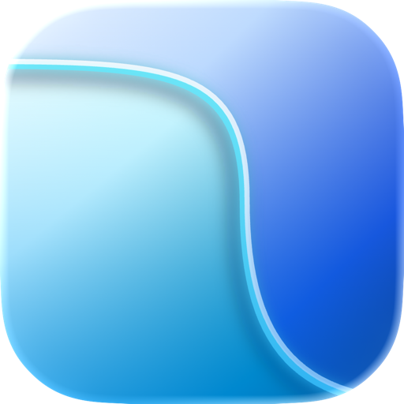

<div align="center">
  
  <h1>OneNotch</h1>
  <p><strong>A native macOS companion that turns the notch into a useful part of your desktop.</strong></p>
  <p>
    <a href="https://github.com/tranhuy2706/OneNotch-releases/releases/latest/download/OneNotch.dmg"><strong>Download for macOS</strong></a>
    ·
    <a href="https://github.com/tranhuy2706/OneNotch-releases/releases/latest">Release notes</a>
    ·
    <a href="appcast.xml">Update feed</a>
  </p>
  <p>
    
    
    
    
    
  </p>
</div>

## About OneNotch

OneNotch brings clipboard history, media controls, Live Activities, timers,
calendar events, AI agent status, and Lock Screen integrations into a polished
interface designed for macOS.

It is built natively with SwiftUI and AppKit, follows your displays and Spaces,
and includes layouts for MacBooks with a notch, notch-less Macs, and external
displays.

## Download

The current public beta is **OneNotch 0.1.0 (build 4)**.

[**Download the latest OneNotch DMG**](https://github.com/tranhuy2706/OneNotch-releases/releases/latest/download/OneNotch.dmg)

The stable download URL always points to the newest published build. Previous
versioned DMGs remain attached to their GitHub Release for reference.

## Requirements

- macOS 15.0 or later
- Apple Silicon Mac
- Accessibility, Screen Recording, Calendar, or other permissions may be
  requested only when their related features are enabled

## Installation

1. Download `OneNotch.dmg` using the link above.
2. Open the disk image.
3. Drag **OneNotch** into the **Applications** folder.
4. Launch OneNotch and complete the onboarding steps.

## Security and verification

Every public DMG is signed with an Apple Developer ID certificate, notarized by
Apple, and stapled before upload.

SHA-256 for **OneNotch 0.1.0 (build 4)**:

```text
b85083703aa8301ed2ed5e38e5cef81b2b0f4bdc5e2ee0795dcd361817508054
```

Verify a downloaded file in Terminal:

```bash
shasum -a 256 ~/Downloads/OneNotch.dmg
```

## Automatic updates

OneNotch uses Sparkle to check for signed updates. The public update feed is
[`appcast.xml`](appcast.xml). Update packages are verified using their Sparkle
EdDSA signature before installation.

## About GitHub's “Source code” downloads

GitHub automatically adds `.zip` and `.tar.gz` source archives to every public
release tag. In this repository, those archives contain only the files tracked
here—release documentation and the Sparkle update feed. They do **not** contain
the private OneNotch application source code.

## Support

If you encounter a problem, open an
[issue](https://github.com/tranhuy2706/OneNotch-releases/issues) and include your
macOS version, Mac model, and the steps needed to reproduce it.

> OneNotch is currently beta software. Features and system integrations may
> change as macOS evolves.
